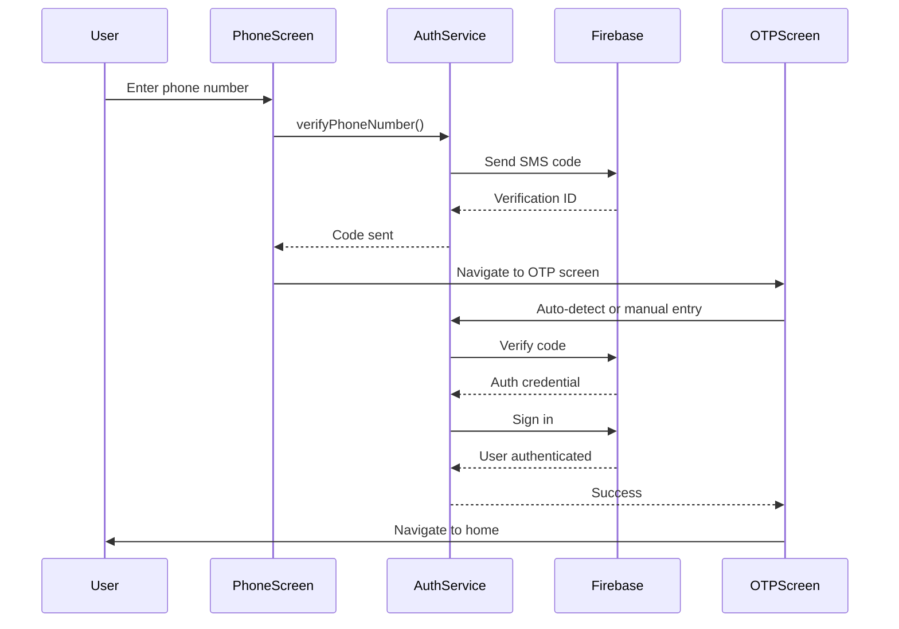

# Firebase Phone Authentication Module Implementation Plan

## Overview

Create a standalone, reusable Firebase phone authentication module with SMS verification. The module will be self-contained in `lib/firebase_mobile_auth/` and can be easily copied to other projects with minimal configuration.

## Architecture

The module will follow a clean architecture pattern with clear separation of concerns:

```
lib/firebase_mobile_auth/
├── models/
│   └── auth_state.dart              # Auth state enums and models
├── services/
│   ├── firebase_auth_service.dart   # Core Firebase auth logic
│   └── phone_auth_service.dart      # Phone-specific auth operations
├── widgets/
│   ├── phone_input_screen.dart     # Phone number entry screen
│   ├── otp_verification_screen.dart # OTP entry/verification screen
│   └── auth_error_widget.dart      # Error display widget
├── utils/
│   ├── phone_validator.dart         # Phone number validation
│   └── country_code_helper.dart     # Country code utilities
├── config/
│   └── auth_config.dart             # Configuration class for customization
└── firebase_mobile_auth.dart        # Main export file
```

## Implementation Details

### 1. Dependencies

Add required packages to `pubspec.yaml`:

- `firebase_auth: ^4.15.0` - Firebase authentication
- `country_code_picker: ^3.0.0` - Country code selection
- `flutter_sms_autofill: ^2.2.0` - Auto-detect SMS codes (Android)

### 2. Core Services

#### `firebase_auth_service.dart`

- Initialize Firebase Auth
- Handle phone number verification flow
- Manage verification ID storage
- Sign in with credential
- Handle auth state changes
- Error handling and conversion

#### `phone_auth_service.dart`

- Send verification code
- Verify SMS code
- Auto-retrieve SMS code (Android)
- Resend code functionality
- Timeout handling

### 3. Models

#### `auth_state.dart`

- `AuthStatus` enum (unauthenticated, codeSent, verifying, authenticated, error)
- `PhoneAuthResult` model
- `AuthError` model with error types

### 4. UI Components

#### `phone_input_screen.dart`

- Phone number input field
- Country code picker
- Validation feedback
- Send OTP button
- Loading states

#### `otp_verification_screen.dart`

- OTP input field (6 digits)
- Auto-fill SMS code (Android)
- Manual entry option
- Resend code button with timer
- Verify button
- Error display

#### `auth_error_widget.dart`

- Display authentication errors
- User-friendly error messages
- Retry functionality

### 5. Configuration

#### `auth_config.dart`

- Theme colors (primary, error, background)
- Text styles
- Button styles
- Customizable messages
- Timeout durations

### 6. Utilities

#### `phone_validator.dart`

- Validate phone number format
- Format phone numbers
- Extract country code

#### `country_code_helper.dart`

- Country code list
- Default country selection
- Country code formatting

## Authentication Flow



## Key Features

1. **Phone Number Verification**

   - Country code selection
   - Phone number validation
   - Format phone numbers for display

2. **SMS Verification**

   - Auto-detect SMS code on Android
   - Manual entry fallback
   - Resend code functionality
   - Code expiration handling

3. **Error Handling**

   - Network errors
   - Invalid phone numbers
   - Invalid/expired codes
   - Too many attempts
   - User-friendly error messages

4. **State Management**

   - Loading states
   - Success/error states
   - Code sent confirmation
   - Verification progress

5. **Customization**

   - Basic theme colors
   - Text styles
   - Button customization
   - Configurable timeouts

## Files to Create

1. `lib/firebase_mobile_auth/models/auth_state.dart`
2. `lib/firebase_mobile_auth/services/firebase_auth_service.dart`
3. `lib/firebase_mobile_auth/services/phone_auth_service.dart`
4. `lib/firebase_mobile_auth/widgets/phone_input_screen.dart`
5. `lib/firebase_mobile_auth/widgets/otp_verification_screen.dart`
6. `lib/firebase_mobile_auth/widgets/auth_error_widget.dart`
7. `lib/firebase_mobile_auth/utils/phone_validator.dart`
8. `lib/firebase_mobile_auth/utils/country_code_helper.dart`
9. `lib/firebase_mobile_auth/config/auth_config.dart`
10. `lib/firebase_mobile_auth/firebase_mobile_auth.dart` (main export)

## Integration Requirements

The module will require:

- Firebase initialized in main app
- Firebase Auth enabled in Firebase Console
- Phone authentication enabled in Firebase Console
- Android: SMS permissions in AndroidManifest.xml
- iOS: APNs configured for reCAPTCHA fallback

## Testing Considerations

- Unit tests for validation logic
- Widget tests for UI components
- Integration tests for auth flow
- Error scenario testing

## Documentation

- Update `readme.md` with:
  - Setup instructions
  - Usage examples
  - Configuration options
  - Integration guide
  - Troubleshooting